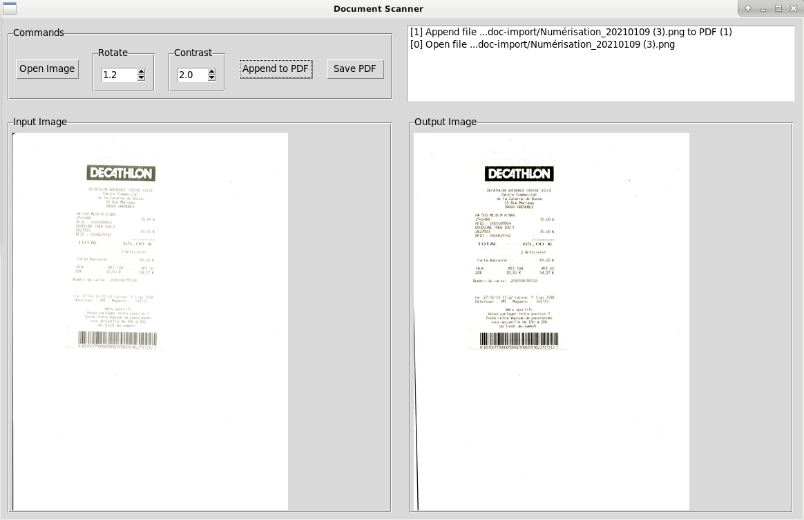

# Document Scanner

The main idea of this project is to simplify the document scanning procedure:
- scan using the physical scanner (maybe comming soon)
- rotate and apply contrast (done)
- save output as pdf file (done)



# Prepare Repository

*Important! The steps described below were tested with python version 3.7.*

Execute these commands:
```sh 
# Create a virtual envirenment
python3 -m venv venv

# Enter in virtual envirenment
source venv/bin/activate

# Install dependencies
sudo apt-get install python3-tk
python3 -m pip install -r requirements.txt
```

# License

Refer to the [LICENSE](LICENSE) file.
