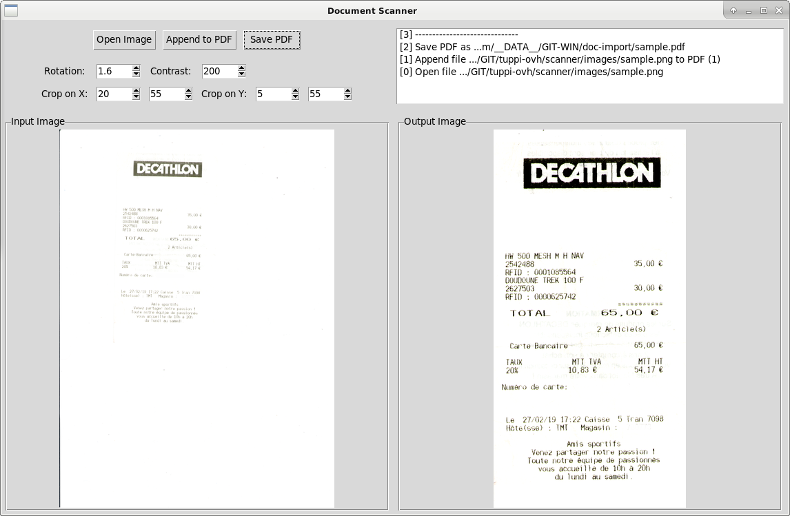

# Document Scanner

## Overview

The main idea of this project is to simplify the document scanning process:
- open scanned image file (done)
- rotate and apply contrast (done)
- save output as pdf file (done)



## Requirements

*Important! The steps described below were tested with python version 3.7.*

- Execute these commands:

```sh 
# Create a virtual envirenment
python3 -m venv venv

# Enter in virtual envirenment
source venv/bin/activate

# Install dependencies
sudo apt-get install python3-tk
sudo apt-get install tesseract-ocr
python3 -m pip install pillow
python3 -m pip install pytesseract
```

- Define environment variable `TESSDATA_PREFIX` to `~/.tessdata/`.

- Download tesseract dictionnaries to `~/.tessdata/`.

## Configuration File

Create `config.py` in the repository with this content:

```py
DEFAULT_INPUT_PATH = "/absolut/path/to/open/input/file"
DEFAULT_OUTPUT_PATH = "/absolut/path/to/save/output/file"
```

## Launch

Execute these commands:

```sh 
# Enter in virtual envirenment
source venv/bin/activate

## Launch GUI
python3 gui.py
```

## Frames

```
|-------------------frame0-----------------------|
|-------frame00--------|--------frame01----------|
|-------frame000-------|                         |
|-------frame001-------|                         |         
|-------frame002-------|                         |
|-------------------frame1-----------------------|
|---frame10----|-----frame11----|----frame12-----|
|              |                |                |
|--------------|----------------|----------------|
```

## Generate Tags

```sh
$ find . -maxdepth 10 -type d -printf '%P \n' | grep -v ".git"
```

## License

Refer to the [LICENSE](LICENSE) file.

## TODO

- Preview the next file.
- Add filename pattern.